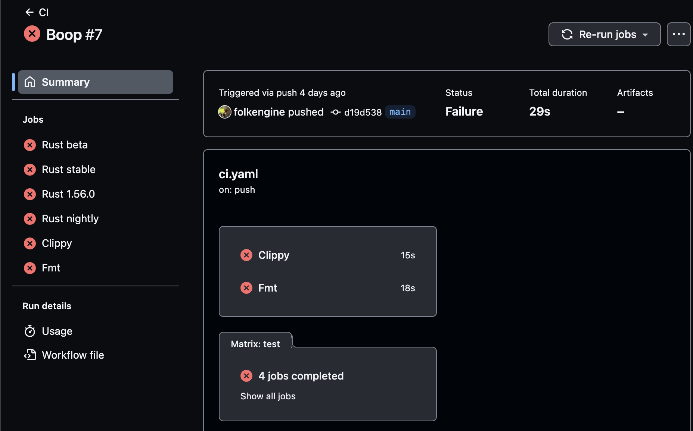

# The Solution

You can tell what all is failing by going to the 
[Actions tab](https://github.com/devplaybooks/rust_worlds_simplest_kata/actions) on the repository and clicking on the
[build](https://github.com/devplaybooks/rust_worlds_simplest_kata/actions/runs/3722049286).



CI is running four versions of Rust: beta, stable, 1.56.0, and nightly. All of them
are failing. Right off the bat, that tells you that this isn't some corner case.
Something is fundamentally wrong with your code. 

Let's fix the failing unit test first. Running `cargo test` spells it out pretty
clearly:

```shell
❯ cargo test
...
running 1 test
test tests::hello_world ... FAILED

failures:

---- tests::hello_world stdout ----
thread 'tests::hello_world' panicked at 'assertion failed: `(left == right)`
  left: `"Hello, world!"`,
 right: `"Hello, wirld!"`', src/main.rs:15:9
note: run with `RUST_BACKTRACE=1` environment variable to display a backtrace


failures:
    tests::hello_world

test result: FAILED. 0 passed; 1 failed; 0 ignored; 0 measured; 0 filtered out; finished in 0.00s

error: test failed, to rerun pass `--bin rust_worlds_simplest_kata`
```

Our function is not returning what is expected. That's an easy fix. Change the 
string that our function returns to `Hello, world!` and we are green.

The rustfmt format is an easy fix. Simply run `cargo fmt` on your checked out
copy of the repo and it's gone. 

Git diff will show you what fmt did:

```shell
❯ git diff
diff --git a/src/main.rs b/src/main.rs
index 313ea0f..0982a3b 100644
--- a/src/main.rs
+++ b/src/main.rs
@@ -1,4 +1,4 @@
-fn  hello__world() -> &'static str {
+fn hello__world() -> &'static str {
     "Hello, wirld!"
 }
(END)
```

The clippy error spells it out for you very clearly. We've got two underscores
between the words in the function name. Convert the identifier to `hello_world`.
That's an easy fix.

```shell
Run cargo clippy -- -Dclippy::all -Dclippy::pedantic
    Checking rust_worlds_simplest_kata v0.1.0 (/home/runner/work/rust_worlds_simplest_kata/rust_worlds_simplest_kata)
error: function `hello__world` should have a snake case name
 --> src/main.rs:1:5
  |
1 | fn  hello__world() -> &'static str {
  |     ^^^^^^^^^^^^ help: convert the identifier to snake case: `hello_world`
  |
  = note: `-D non-snake-case` implied by `-D warnings`

error: could not compile `rust_worlds_simplest_kata` due to previous error
Error: Process completed with exit code 101.
```